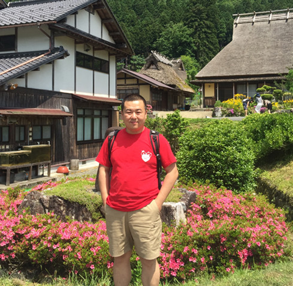

  
 [新闻](#News) | [代表论文](#Publications) | [获奖与荣誉](#Rewards) | [社会服务](#Services)| [学生](#Students) | [资源](#Resources) |
# 宋鹏 (<a href="/index-en.html">Peng Song</a>)  

***"Theory without Practice is empty; but Practice without Theory is blind" - Immanuel Kant***    
***"Each problem that I solved became a rule which served afterwards to solve other problems" - Rene Descartes***   

    
目前为烟台大学计算机与控制工程学院副教授、硕士生导师，博士毕业于东南大学信息学院，先后在微软亚洲研究院、摩托罗拉等公司实习及工作。现为IEEE/IEICE/中国计算机学会/中国人工智能学会会员，先后主持国家/省自然科学基金、国家/教育部重点实验室开放基金多项。相关工作发表在国内外重要学术期刊，包括IEEE Trans汇刊（TAC、TASLP、TCDS）、Speech Communication、Applied Acoustics、Expert Systems with Applications、Knowledge-Based Systems、Digital Signal Processing、电子学报、声学学报及重要国际学术会议ICASSP、INTERSPEECH、CIKM等。目前主要研究兴趣包括***情感计算、模式识别、语音信号处理、多模态数据分析***等。

—————————————————————————————————————————————

## 基本信息
**工作单位：** 烟台大学计算机与控制工程学院   
**电子邮箱：** pengsongseu@gmail.com  
**办公地址：** 山东省烟台市莱山区清泉路30号烟台大学综合楼633

 
## **新闻**
* 🎈🎈🎈2023欢迎各位同学加入课题组攻读硕士研究生！同时欢迎本科生进入实验室！欢迎感兴趣的同学与我联系. 
* *05/06/2023* 祝贺牟金帅、周世璇获得2023年研究生科技创新基金支持！
* *05/04/2023* 祝贺李绍凯、刘向雨分别获得[山东省优秀毕业生、烟台大学优秀毕业生称号！](/files/2023优秀毕业生.pdf)
* *04/27/2023* 祝贺周世璇同学的论文["Structural Regularization Based Discriminative Multi-view Unsupervised Feature Selection”](https://www.sciencedirect.com/science/article/pii/S0950705123003519)被Knowledge-Based Systems录用！
* *04/26/2023* 祝贺姬亮同学的论文“Learning Transferable Non-negative Feature Representation for Facial Expression Recognition”被Digital Signal Processing录用！
* *03/21/2023* 祝贺牟金帅同学的论文[“Dual-graph Regularized Concept Factorization for Multi-view Clustering”](https://www.sciencedirect.com/science/article/pii/S0957417423004517) 被Expert Systems With Applications（中科院SCI一区, IF:8.665）录用！
* *02/16/2023* 祝贺李绍凯同学的论文“A Generalized Subspace Distribution Adaptation Framework for Cross-Corpus Speech Emotion Recognition” 被语音领域重要国际会议ICASSP 2023录用！
* *02/10/2023* 祝贺实验室项目“基于知识迁移的跨语种语音情感识别研究”获得省部共建藏语智能信息处理及应用国家重点实验室开放基金支持！
* *12/30/2022* 祝贺刘向雨同学的工作“基于矩阵分解的多视图聚类研究”荣获[2022年山东省研究生创新成果三等奖](http://edu.shandong.gov.cn/art/2022/12/27/art_11982_10308544.html)!
* *12/23/2022* 祝贺周士璇同学的论文[“Soft-Label Guided Non-Negative Matrix Factorization for Unsupervised Feature Selection”](https://www.sciencedirect.com/science/article/abs/pii/S0957417422024873)被Expert Systems With Applications录用！
* *12/13/2022* 祝贺我们的论文“Learning Transferable Sparse Representations for Cross-corpus Facial Expression Recognition”入选[2022年山东省人工智能年度优秀学术论文！](https://www.sdaai.org.cn/newsinfo/4771874.html)
* *12/11/2022* 祝贺刘向雨同学的论文[“Virtual Label Guided Multi-view Non-negative  Matrix Factorization for Data Clustering”](https://www.sciencedirect.com/science/article/abs/pii/S105120042200505X)被Digital Signal Processing录用！
* *11/15/2022* 祝贺李绍凯同学的论文[“基于迁移判别回归的跨域语音情感识别”](https://kns.cnki.net/kcms/detail/detail.aspx?dbcode=CAPJ&dbname=CAPJLAST&filename=XXCN20221124001&uniplatform=NZKPT&v=Gm2Rh2seRfbZJmBbvhVFeGHexNkNLeFcEjEWV3VUO0k4n6YQIsXpcz1bpX3QlmYn)被《信号处理》录用！
* *10/20/2022* 祝贺[刘向雨、李绍凯、姬亮获得2022年研究生国家奖学金](/files/关于颁发2022年研究生奖学金的决定.pdf)！[*相关报道*](https://mp.weixin.qq.com/s/X2ysqIOVWWbqz6AzhMIpTg)
* *10/18/2022* 祝贺宋紫浩同学的论文[“Latent Energy Preserving Embedding for Unsupervised Feature Selection"](https://www.sciencedirect.com/science/article/pii/S1051200422004110)被Digital Signal Processing录用！
* *09/30/2022* 祝贺陈栋梁同学的硕士学位论文“基于稀疏迁移学习的人脸表情识别”获得[2022年度山东省人工智能优秀学位论文！](https://www.sdaai.org.cn/newsinfo/4360945.html)
* *08/04/2022* 祝贺刘向雨同学的论文["Incomplete Multi-view Clustering via Virtual-label Guided Matrix Factorization"](https://www.sciencedirect.com/science/article/pii/S0957417422015159) 被Expert Systems With Applications（IF:8.665，中科院SCI一区）录用！
* *07/02/2022* 祝贺李绍凯同学的论文["Transferable Discriminant Linear Regression for Cross-corpus Speech Emotion Recognition"](https://www.sciencedirect.com/science/article/pii/S0003682X22002936?dgcid=author) 被Applied Acoustics(IF:3.614, 中科院SCI二区)录用！

[**更多新闻...**](/pastnews)

 
## **代表论文:** （<a href="https://scholar.google.com/citations?user=6zxeFQIAAAAJ&hl=zh-TW">谷歌学术</a>, <a href="https://dblp.org/pid/58/3960-2.html">DBLP</a>）
\# 学生，\* 通讯作者
1. Wenjing Zhang#,  <u>Peng Song*</u>, Wenming Zheng. [Joint Local-Global Discriminative Subspace Transfer Learning for Facial Expression Recognition](https://ieeexplore.ieee.org/document/9761954). ***IEEE Transactions on Affective Computing***. 2022. Doi:10.1109/TAFFC.2022.3168834.
2.  Weijian Zhang#, <u>Peng Song*</u>, Dongliang Chen, Chao Sheng, Wenjing Zhang. [Cross-corpus Speech Emotion Recognition Based on Joint Transfer Subspace Learning and Regression](https://ieeexplore.ieee.org/document/9340391/). ***IEEE Transactions on Cognitive and Developmental Systems***. 2022, 14(2): 588-598.
7. Dongliang Chen#, <u>Peng Song*</u>, Wenming Zheng. [Learning Transferable Sparse Representations for Cross-corpus Facial Expression Recognition](https://ieeexplore.ieee.org/document/9423630). ***IEEE Transactions on Affective Computing***. 2021, Doi:10.1109/TAFFC.2021.3077489
9. <u>Peng Song*</u>, Wenming Zheng, Yanwei Yu, Shifeng Ou. [Speech Emotion Recognition Based on Robust Discriminative Sparse Regression](https://ieeexplore.ieee.org/document/9080065). ***IEEE Transactions on Cognitive and Developmental Systems***, 2021, 2, 343-353.
2033. <u>Peng Song*</u>, Wenming Zheng. [Feature Selection Based Transfer Subspace Learning for Speech Emotion Recognition](https://ieeexplore.ieee.org/document/8276251). ***IEEE Transactions on Affective Computing***. 2020, 11(3): 373-382.
2034. Tengfei Song, Wenming Zheng, <u>Peng Song</u>, Zhen Cui, [EEG Emotion Recognition Using Dynamical Graph Convolutional Neural Networks](https://ieeexplore.ieee.org/document/8320798), ***IEEE Transactions on Affective Computing***. 2020, 11(3): 532-541. （**年度最佳论文，ESI高被引**）
2035. Weijian Zhang#, <u>Peng Song*</u>. [Transfer sparse discriminant subspace learning for cross-corpus speech emotion recognition](https://ieeexplore.ieee.org/document/8910397). ***IEEE/ACM Transactions on Audio, Speech, and Language Processing***. 2020, 28, 307-318.
2039. <u>Peng Song*</u>. [Transfer Linear Subspace Learning for Cross-corpus Speech Emotion Recognition](https://ieeexplore.ieee.org/document/7931593).  ***IEEE Transactions on Affective Computing***. Vol. 10, No. 2, pp. 265-275, 2019.
2040. Shaokai Li#, <u>Peng Song*</u>, Wenjing Zhang. [Transferable Discriminant Linear Regression for Cross-corpus Speech Emotion Recognition](https://www.sciencedirect.com/science/article/pii/S0003682X22002936?dgcid=author). ***Applied Acoustics*** 2022, 197:108919.
2041. Xiangyu Liu#, <u>Peng Song*</u>. [Incomplete Multi-view Clustering via Virtual-label Guided Matrix Factorization](https://www.sciencedirect.com/science/article/pii/S0957417422015159). ***Expert Systems With Applications*** 2022, 210, 118408.
2050. Shixuan Zhou#,  <u>Peng Song*</u>, Zihao Song, Liang Ji. [Soft-Label Guided Non-Negative Matrix Factorization for Unsupervised Feature Selection](https://www.sciencedirect.com/science/article/abs/pii/S0957417422024873). ***Expert Systems With Applications*** 2023, 216, 119468.
2051. Shixuan Zhou#,  <u>Peng Song*</u>, Yanwei Yu, Wenming Zheng. [Structural regularization based discriminative multi-view unsupervised feature selection](https://www.sciencedirect.com/science/article/pii/S0950705123003519). ***Knowledge-Based Systems*** 2023, 223, 110601.

[**完整论文列表...**](/full-paper-list)  

 
## **获奖与荣誉**
* *2022* IEEE计算机协会2020年情感计算汇刊（唯一）最佳论文奖 [EEG Emotion Recognition Using Dynamical Graph Convolutional Neural Networks](./pictures/TAC_bestpaper.png), [官网链接](https://www.computer.org/publications/best-paper-award-winners)
* *2022* 山东省人工智能自然科学奖二等奖[面向大规模、高维、流式大数据的高效异常检测方法研究](https://www.sdaai.org.cn/newsinfo/4492364.html)
* *2022* 山东省研究生创新成果三等奖[基于矩阵分解的多视图聚类研究](http://edu.shandong.gov.cn/art/2022/12/27/art_11982_10308544.html)
* *2021* 烟台大学科学技术进步二等奖[跨语种语音情感识别研究]()
* *2021* 第十六届全国人机语音通讯学术会议最佳论文提名 [基于迁移回归的跨域语音情感识别](./pictures/ncmmsc_bestpaper_runnerup.png)
* *2020* 山东省研究生优秀成果奖三等奖 [面向语音情感识别的迁移子空间学习方法研究](http://edu.shandong.gov.cn/art/2020/12/31/art_11990_10285683.html)

 
## **社会活动**
目前担任以下期刊或国际会议的审稿人：
* IEEE Transactions on Affective Computing、IEEE-ACM Transactions on Audio, Speech and Language Processing、IEEE Signal Processing Magazine、IEEE Transactions on Knowledge and Data Engineering、IEEE Transactions on Circuits and Systems for Video Technology、IEEE Multimedia、IEEE Signal Processing Letters、Neural Networks、Speech Communication、Information Science、 Neurocomputing、Information Fusion、Signal Processing、 Applied Acoustics、 Computer Speech&Languange、 Digital Signal Processing、Biomedical Signal Processing and Control、 INTERSPEECH 2018-2023、 ICASSP 2021-2023、 NCMMSC 2021-2022、 ICPR 2022、计算机学报、中文信息学报、中国图形图象学报、清华大学学报...

 
## **指导学生**

|研究生奖项|学生（年度）|
|:----|:----|
|研究生国家奖学金|张伟建（2020）、刘向雨（2022）、李绍凯（2022）、姬亮（2022）|
|山东省研究生优秀成果奖|张伟建（2020，三等奖）、刘向雨（2022，三等奖)|
|山东省优秀毕业生|张雯婧（2022）、李绍凯（2023）|
|山东省人工智能优秀硕士学位论文|陈栋梁（2022）|
|烟台大学研究生优秀成果奖|张雯婧（2021，二等奖）|
|烟台大学优秀毕业生|陈栋梁（2021）、刘向雨（2023）|
|学术论文奖|李绍凯（2021，NCMMSC最佳论文提名）|

### **在读研究生**
1. [程远波](/groupmembers)，2022级，研究方向：视角缺失的多视图聚类
2. [段萌](/groupmembers)，2022级，研究方向：多视图特征选择
3. [王昊](/groupmembers)，2022级，研究方向：跨域语音情感识别
1. [刘涛](/groupmembers)，2021级，研究方向：基于回归迁移学习的跨域人脸表情识别研究 （一篇论文大修，一篇论文在投）
2. [刘兆虎](/groupmembers)，2021级，研究方向：基于潜在嵌入空间的多视图子空间聚类方法研究 （两篇论文在审）
3. [周士璇](/groupmembers)，2021级，研究方向：基于判别信息与矩阵分解的无监督特征选择 （ESWA、KBS论文各刊出一篇，一篇论文在审）
4. [姜慎杰](/groupmembers)，2021级，研究方向：基于无监督迁移学习的语音情感识别 （一篇论文在审）
5. [牟金帅](/groupmembers)，2021级，研究方向：基于子空间学习的多视图聚类方法研究 （ESWA论文刊出一篇，一篇论文在审）
6. [王润](/groupmembers)， 2021级，研究方向：域自适应人脸表情识别研究 （一篇论文大修，一篇论文在投）
1. [赵可可](/groupmembers)，2020级，研究方向：基于子空间学习的跨域语音情感识别（CCBR2021、IEICE论文各一篇,一篇论文在审）
2. [姬亮](/groupmembers)，2020级， 研究方向：基于迁移非负矩阵分解的跨域人脸表情识别研究（DSP论文刊出两篇）
3. [刘向雨](/groupmembers)，2020级，研究方向：基于矩阵分解的多视图聚类方法研究 (ESWA论文刊出一篇、DSP论文刊出两篇)
4. [李绍凯](/groupmembers)，2020级，研究方向：基于迁移回归与子空间学习的语音情感识别（NCMMSC2021、Interspeech2022、ICASSP 2023、Applied Acoustics、信号处理论文各一篇，一篇论文大修）
5. [宋紫浩](/groupmembers)，2020级，研究方向：基于虚拟标签回归和自表示的特征选择 (IEICE论文刊出一篇、DSP论文刊出一篇)

### **毕业研究生**
1. [张雯婧](/groupmembers)，2019级，研究方向：基于迁移学习的跨域人脸表情识别 (IEEE TAC、DSP、IEICE、《数据采集与处理》各刊出一篇), 毕业去向：烟台市质量技术监督局
3. [盛超](/groupmembers)， 2019级，研究方向：基于图正则的无监督特征选择 (DSP刊出两篇、《信号处理》刊出一篇)，毕业去向：南京某厂
4. [陈栋梁](/groupmembers)，2018级，研究方向：基于稀疏迁移学习的人脸表情识别. (IEEE TAC、IEICE、DSP论文各刊出一篇,一篇论文在审)，毕业去向：华南理工读博 
5. [张伟建](/groupmembers)，2018级，研究方向：基于子空间迁移学习的语音情感识别. (IEEE TASLP、TCDS论文各刊出一篇)，毕业去向：中国移动淄博分公司 
         
### **优秀本科毕业论文**
1. 2019年 基于深层子空间学习的人脸表情识别方法研究 张迎雪
2. 2018年 基于机器学习的交通大数据预测   李尚泽

### **大学生科技创新活动**
1. 2023年 研究生科技创新基金项目：无监督多视图特征选择方法研究（周世璇）
2. 2023年 研究生科技创新基金项目：基于子空间学习的多视图聚类方法研究（牟金帅）
3. 2022年 研究生科技创新基金项目(重点)：基于非负矩阵分解的多视图聚类方法研究（刘向雨）
4. 2022年 研究生科技创新基金项目：基于特征迁移学习的跨域人脸表情识别（姬亮）
5. 2021年 研究生科技创新基金项目：基于迁移学习的跨域人脸表情识别研究（张雯婧）
6. 2020年 研究生科技创新基金项目(重点)：基于子空间迁移学习的语音情感识别研究（张伟建）
7. 2019年 “智慧实验室”烟台大学第一届研究生创新实践大赛(特等奖)：跨区域的人脸表情识别（陈栋梁、张雯婧）
8. 2017年 大学生创新创业训练计划项目:“基于机器学习的城市交通动态预测” （李倩、张迎雪、马文静、李尚泽、贾召飞等）
9. 2016-2019年 世界大学生超级计算机比赛ASC（二等奖）

### **团队**
[**活动照片**](/pictures)

 
## **资源**
### **资料参考**
* [中国计算机学会推荐国际学术会议和期刊目录](https://www.ccf.org.cn/Academic_Evaluation/By_category/)
* [清华大学计算机学科推荐学术会议和期刊列表](http://numbda.cs.tsinghua.edu.cn/~yuwj/TH-CPL.pdf)
* [中国自动化学会推荐学术期刊目录（试行）](http://www.caa.org.cn/Public/FCKuploads/00.pdf)
* [中国科技期刊卓越行动计划入选期刊目录](https://www.ahjzu.edu.cn/_upload/article/files/9a/d0/ebaa204446199e269bb884015b91/da339269-fd73-40f3-a107-3ca40bfdfe6e.pdf)
* [如何做研究](http://www.jdl.ac.cn/how_to_research/index1_1.htm#1)
* [师生关系大杂烩](https://frostliu.github.io/discussions)
* [AI会议Deadline](https://ccfddl.github.io/)
* [助理教授/博士生存指南](https://github.com/JunweiLiang/awesome_lists)
* [学术研究入门](https://dl.ccf.org.cn/albumList/6173671945340928?_ack=1)

### **Open source**
* [机器学习相关博客](https://kailugaji.github.io/)
* [60分钟了解PyTorch](https://www.chamwen.com/2020/09/08/tool_pytorch/)
* [动手学深度学习 PyTorch版](https://space.bilibili.com/1567748478/channel/seriesdetail?sid=358497)
* [迁移学习](https://github.com/jindongwang/transferlearning), [学习视频](https://www.bilibili.com/video/BV1nY411E7Uc/?spm_id_from=333.788)
* 深度领域自适应（迁移学习）[Deep Visual Domain Adaption: A Survey](http://whdeng.cn/papers/18_Wang_Deng_DA_Survey.pdf)([PPT](http://whdeng.cn/papers/deep%20domain%20adaptation%20tutorial-small.pdf)，[讲解视频](https://www.bilibili.com/video/av39436440/?vd_source=58a570d89ed0d1807c63ea664e515390))
* 深度人脸识别（特征学习）[Deep Face Recognition: A Survey](https://arxiv.org/abs/1804.06655) (PPT，[讲解视频](https://www.bilibili.com/video/av79606761/))
* 深度人脸表情识别（情感识别）[Deep Facial Expression Recognition: A Survey](https://arxiv.org/abs/1804.08348), [讲解视频](https://www.iqiyi.com/v_19rs8403ok.html)
* [多视图学习视频](https://ijcai20.org/t37/)
* [情感计算](https://news.sciencenet.cn/dz/upload/2021/4/202141554730409.pdf)
* [机器学习白板推导](https://space.bilibili.com/97068901?from=search&seid=6239692258513089842)
* [跨域人脸表情识别](https://mp.weixin.qq.com/s/vK4jHAntOvwnJ5FwHgDCVw)
* [Awesome Incomplete Graph Representation Learning](https://github.com/WxTu/awesome-incomplete-graph-representation-learning)
* [Awesome Deep Graph Clustering](https://github.com/yueliu1999/Awesome-Deep-Graph-Clustering)
*  [Must-read papers on GNN](https://github.com/thunlp/GNNPapers)
*  [LIBLINEAR — A Library for Large Linear Classification](https://www.csie.ntu.edu.tw/~cjlin/libsvm/)
*  [Deep Clustering: methods and implements](https://github.com/zhoushengisnoob/DeepClustering)
*  [awesome multi-view clustering](https://github.com/wangsiwei2010/awesome-multi-view-clustering)
*  [DeepDG: Deep Domain Generalization Toolkit](https://github.com/jindongwang/transferlearning/tree/master/code/DeepDG)

### **Some Useful Tools**
* [Matrix Calculus](https://www.matrixcalculus.org/?tdsourcetag=s_pctim_aiomsg)
* [Latex Table Convert](https://tableconvert.com/)
* [Latex Table Generator](https://www.tablesgenerator.com/)
* [Excel2latex](https://ctan.org/pkg/excel2latex?lang=en)

### **Books**
* [Matrix cookbook](https://ece.uwaterloo.ca/~ece602/MISC/matrixcookbook.pdf)

[↑Top](#Top)

**更新时间：2023/05/09**

